# LoRaCue

> **Enterprise-grade wireless presentation control with long-range LoRa technology**

## 🎯 Vision

LoRaCue revolutionizes presentation control by combining **long-range LoRa wireless technology** with **professional-grade reliability**. Designed for conference halls, auditoriums, and large venues where traditional RF remotes fail, LoRaCue delivers **sub-50ms latency** over distances exceeding **100 meters indoors** and **1 kilometer line-of-sight**.

## 🚀 Key Features

- **🌐 Long-Range Communication**: LoRa SX1262 transceiver with >100m indoor range
- **⚡ Ultra-Low Latency**: <50ms response time for seamless presentations
- **🔒 Hardware Security**: AES-256 encryption with secure device pairing
- **🖥️ Universal Compatibility**: USB-HID keyboard emulation works with any OS
- **📱 Modern Management**: Web-based configuration and mobile companion app
- **🔋 Extended Battery Life**: Weeks of operation with intelligent power management
- **🔄 OTA Updates**: Wireless firmware updates with dual-partition safety

## 📦 Repositories

### [LoRaCue Firmware](https://github.com/LoRaCue/loracue)
The core ESP32-S3 firmware powering LoRaCue devices. Built on ESP-IDF v5.5 with comprehensive hardware abstraction, OLED UI system, and full Wokwi simulation support for rapid development.

**Key Technologies:**
- ESP32-S3 (Dual-core Xtensa LX7, 240MHz)
- LoRa SX1262 transceiver (868/915MHz)
- SH1106 OLED display (128x64)
- USB-C with HID keyboard emulation
- Bluetooth LE for mobile configuration

### [LoRaCue Manager](https://github.com/LoRaCue/loracue-manager)
Cross-platform companion application for device management, configuration, and firmware updates. Built with modern web technologies for desktop and mobile platforms.

**Features:**
- Device discovery and pairing
- Real-time status monitoring
- Firmware update management
- Configuration backup/restore
- Multi-device fleet management

## 🏗️ Architecture

```mermaid
graph TB
    subgraph "LoRaCue Ecosystem"
        Presenter["📱 Presenter<br/>(Remote Device)"]
        Receiver["🖥️ Receiver<br/>(USB-HID Device)"]
        Manager["📲 Manager App<br/>(Mobile/Desktop)"]
        Computer["💻 Computer/<br/>Projector"]
        
        Presenter <-->|"LoRa<br/>868/915MHz"| Receiver
        Presenter <-.->|"Bluetooth LE<br/>Configuration"| Manager
        Receiver -->|"USB-C<br/>HID Keyboard"| Computer
    end
    
    style Presenter fill:#4CAF50,stroke:#2E7D32,color:#fff
    style Receiver fill:#2196F3,stroke:#1565C0,color:#fff
    style Manager fill:#FF9800,stroke:#E65100,color:#fff
    style Computer fill:#9E9E9E,stroke:#424242,color:#fff
```

## 🛠️ Technology Stack

- **Firmware**: C/C++ with ESP-IDF v5.5
- **Hardware**: ESP32-S3, SX1262 LoRa, SH1106 OLED
- **Security**: AES-256, secure boot, encrypted NVS
- **Connectivity**: LoRa, Bluetooth LE, USB-C, WiFi
- **Development**: Wokwi simulation, GitHub Actions CI/CD
- **Management**: Web-based UI, REST API, OTA updates

## 🎓 Use Cases

- **Conference Presentations**: Reliable control in large auditoriums
- **Educational Institutions**: Multi-room lecture management
- **Corporate Events**: Professional presentation delivery
- **Houses of Worship**: Seamless multimedia control
- **Exhibition Halls**: Long-range booth presentations

## 🌟 Why LoRaCue?

Traditional presentation remotes use 2.4GHz RF technology, which suffers from:
- ❌ Limited range (typically <10m)
- ❌ Interference from WiFi and Bluetooth
- ❌ Line-of-sight requirements
- ❌ Proprietary USB dongles
- ❌ No security or encryption

**LoRaCue solves these problems** with:
- ✅ 100m+ indoor range, 1km+ outdoor
- ✅ Sub-GHz LoRa (868/915MHz) avoids interference
- ✅ Non-line-of-sight operation
- ✅ Standard USB-HID (no dongle needed)
- ✅ Military-grade AES-256 encryption

## 🤝 Contributing

We welcome contributions from the community! Whether you're interested in:
- 🔧 Firmware development
- 📱 Mobile app features
- 🎨 UI/UX improvements
- 📚 Documentation
- 🐛 Bug reports and testing

Check out our repositories and join the development!

## 📄 License

LoRaCue is open-source software licensed under the **GNU General Public License v3.0**. See individual repositories for detailed license information.

## 🏙️ Made with ❤️ in Hannover

LoRaCue is proudly developed in Hannover, Germany, combining German engineering precision with open-source innovation.

---

**Get Started**: [Firmware Repository](https://github.com/LoRaCue/loracue) | [Manager App](https://github.com/LoRaCue/loracue-manager)
